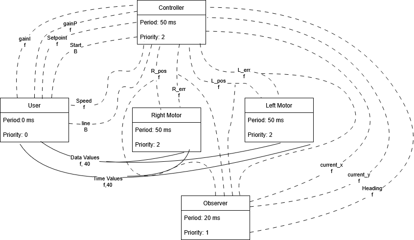
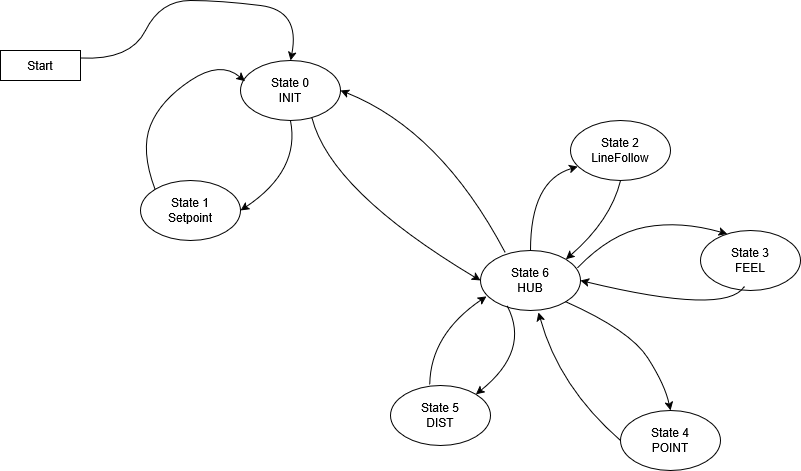
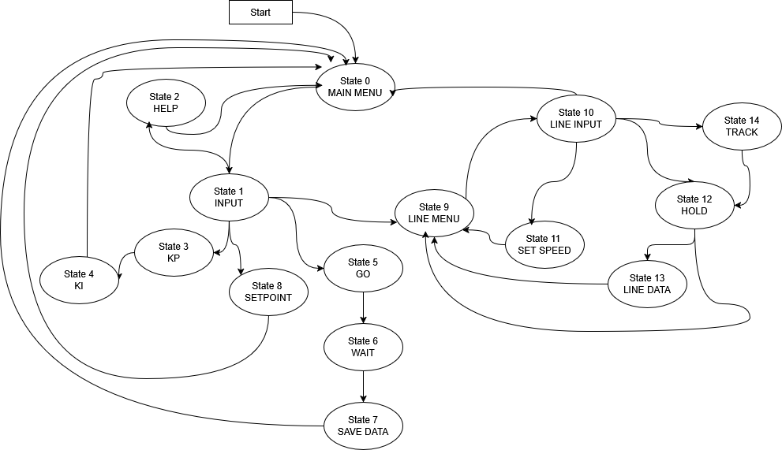
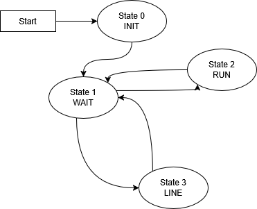

Task Diagrams and Finite State Machines Diagrams
===============================================

Task Diagrams
-------------
Below is a diagram of the tasks and their relationships.

.. image:: _static/.drawio.png
   :alt: Task Diagrams
   :width: 500px

The controller finite state machine

The user interface finite state machine

The motor finite state machine

The observer finite state machine

.. image:: _static/observer.drawio.png

