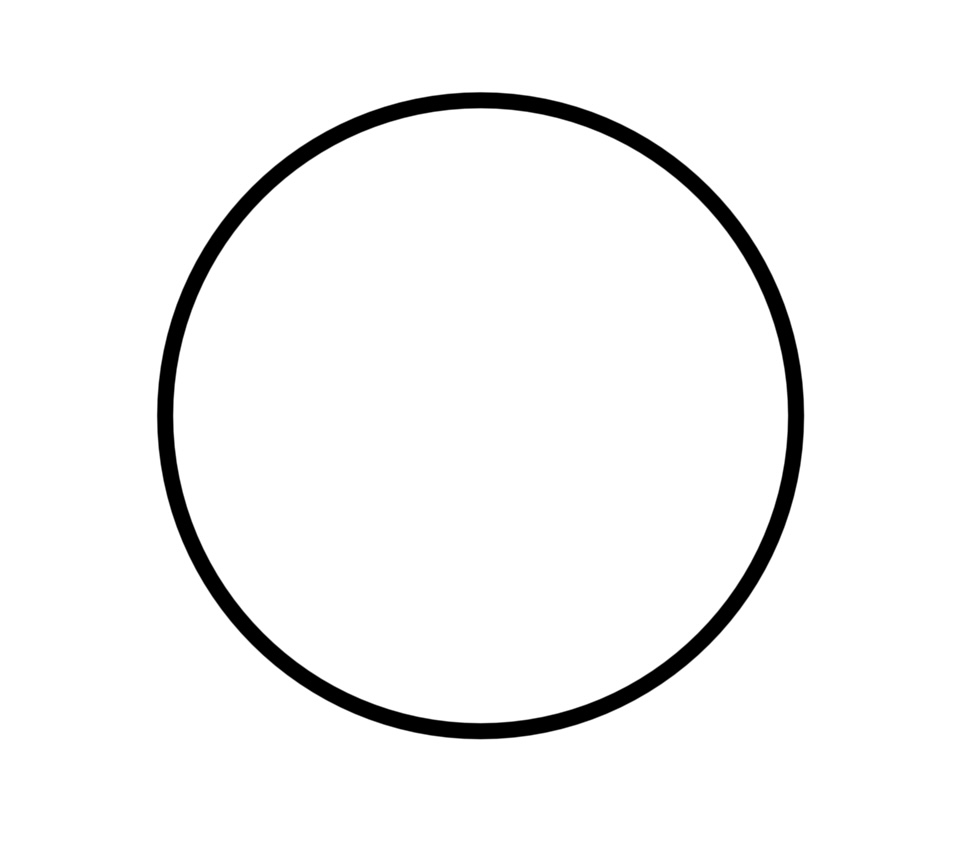
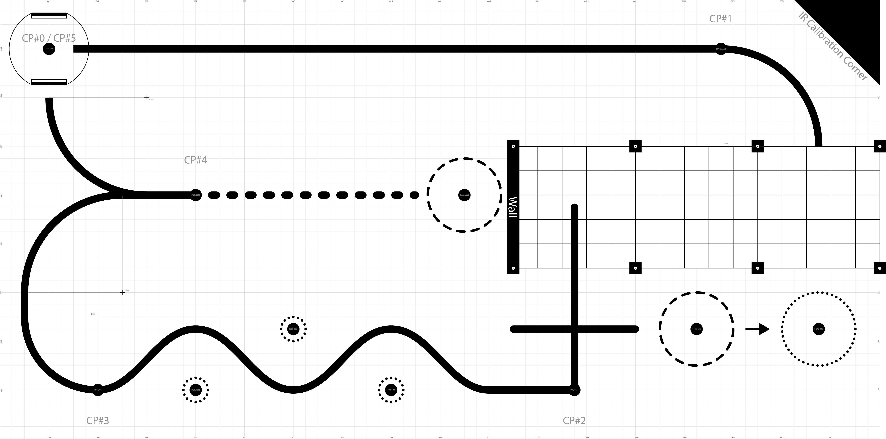

Results
=======

Goals
-----
- To follow a line using:
    - PI control
    - IR sensor array
- To avoid obstacles and navigate a maze without using lines using state estimation and the following hardware:
    - IMU sensor(BNO055)
    - Motor encoders

Initial Line Following Testing:
-------------------------------

We initially tested the line following capabilities of the robot by following a circular track. The user
would input a speed and a gain for the PI controller. The robot would then follow a line at the given 
speed and gain.

.. video:: _static/Romi_circle_follow.mp4

   :width: 500px
   :autoplay:
   :nocontrols:

Final Track to Navigate:

We then tested the line following capabilities of the robot by following the given track. We gave the robot
a default speed of ___ and a gain of 5 for Kp and 0.3 for Ki for the PI controller.

Final Video
----------
.. video:: _static/finalvideo.mp4

   :width: 500px
   :autoplay:
   :nocontrols:
